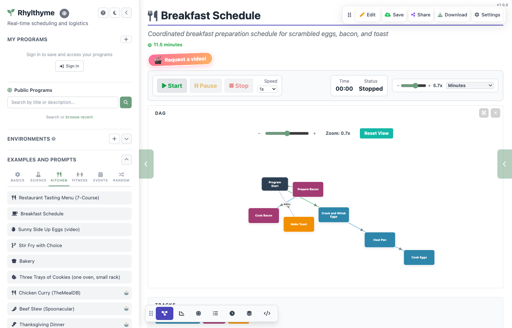
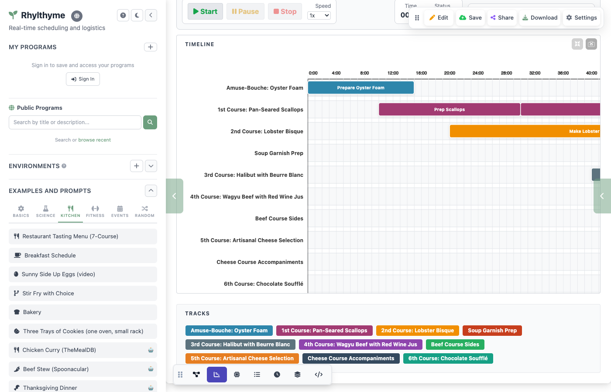
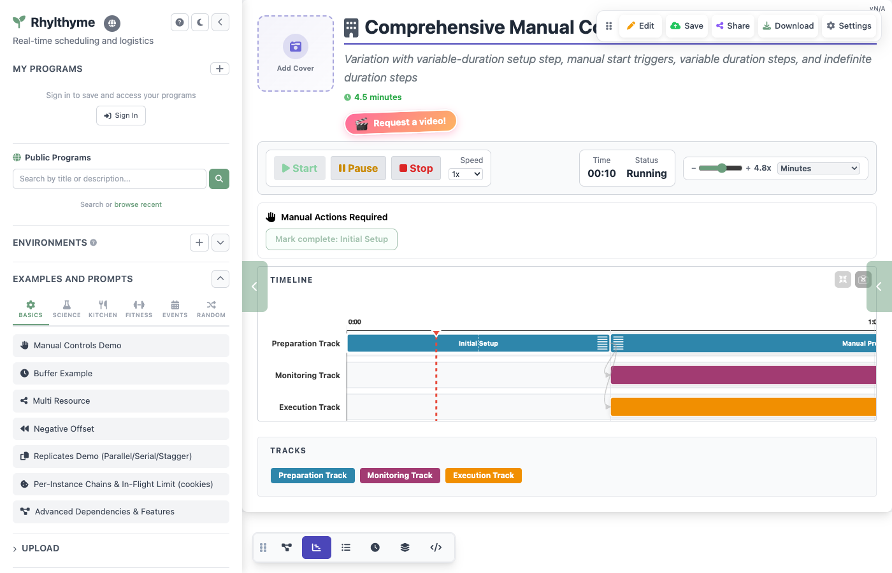
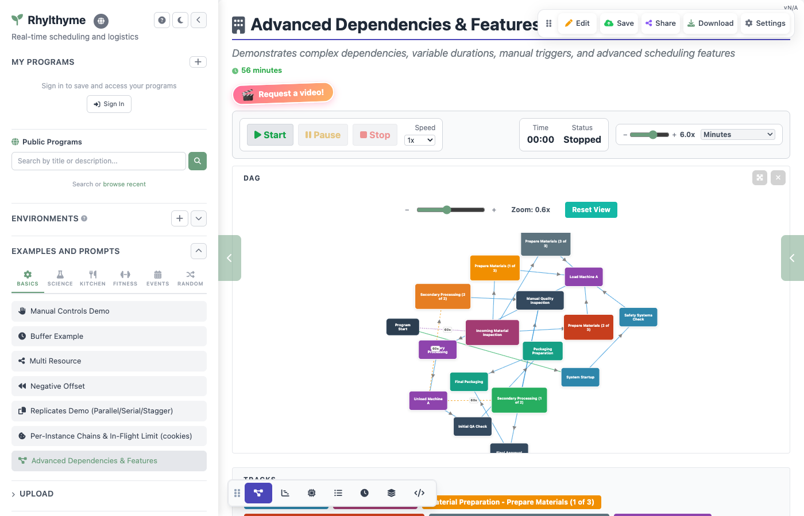
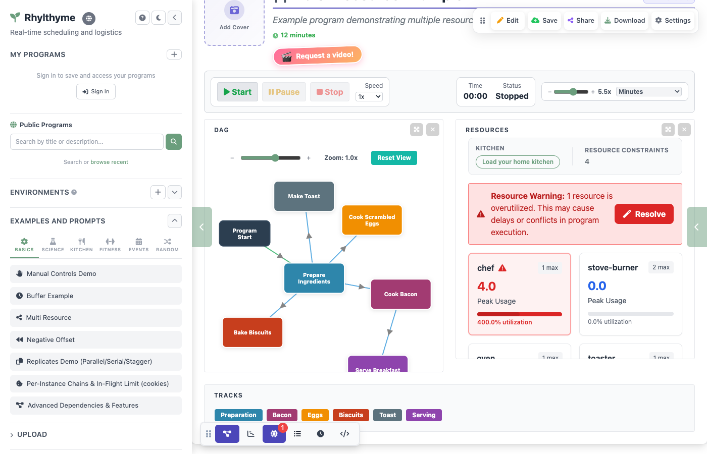

# Core Concepts

Rhylthyme is a framework for defining real-time schedules as structured programs. This page introduces the core concepts you need to understand before creating or running programs.

## Programs

A **program** is a complete schedule defined in JSON. It describes everything that needs to happen, how long each task takes, and what depends on what. Programs have a name, description, optional environment type, and one or more tracks.

```json
{
  "programId": "breakfast-schedule",
  "name": "Breakfast Schedule",
  "description": "Coordinated breakfast preparation",
  "environmentType": "kitchen",
  "tracks": [ ... ],
  "resourceConstraints": [ ... ]
}
```


<!-- TODO: Capture screenshot of a program loaded in the web app DAG view -->

## Tracks

A **track** is a sequence of related steps that execute in order. Tracks run in parallel -- while one track is cooking eggs, another can be making bacon at the same time.

Think of tracks as lanes of activity. In a breakfast program, you might have an "Eggs" track, a "Bacon" track, and a "Toast" track, all progressing simultaneously.

```json
{
  "trackId": "scrambled-eggs",
  "name": "Scrambled Eggs",
  "steps": [ ... ]
}
```


<!-- TODO: Capture screenshot of timeline view with multiple parallel tracks -->

## Steps

A **step** is a single task within a track. Each step has:

- A **name** describing what happens ("Crack and Whisk Eggs")
- A **task** type indicating what resource it uses ("stove-burner", "prep-work")
- A **duration** specifying how long it takes
- A **start trigger** defining when it begins

```json
{
  "stepId": "eggs-crack-whisk",
  "name": "Crack and Whisk Eggs",
  "task": "prep-work",
  "duration": {"type": "fixed", "seconds": 60},
  "startTrigger": {"type": "programStart"}
}
```

## Durations

Steps can have three types of duration:

| Type | Description | Example |
|------|-------------|---------|
| **Fixed** | Runs for an exact number of seconds | Toasting bread for 3.5 minutes |
| **Variable** | Has a minimum, maximum, and default time. Can be completed manually after the minimum. | Cooking eggs: at least 2 min, up to 3 min, usually about 2.5 min |
| **Indefinite** | Runs until the user manually marks it complete. No automatic end. | Watching a reaction until it changes color |

### Fixed Duration

The most common type. The step runs for exactly the specified number of seconds.

```json
{"type": "fixed", "seconds": 300}
```

### Variable Duration

The step has a time range. It auto-completes at `defaultSeconds` unless you click **Mark Complete** after the minimum has passed.

```json
{
  "type": "variable",
  "minSeconds": 120,
  "maxSeconds": 180,
  "defaultSeconds": 150
}
```

### Indefinite Duration

The step runs until you manually mark it complete. Use `defaultSeconds` to set the display width on the timeline.

```json
{
  "type": "indefinite",
  "defaultSeconds": 120
}
```


<!-- TODO: Capture screenshot showing variable/indefinite steps with completion controls -->

## Start Triggers

Triggers define when a step begins:

| Trigger | What It Does | JSON |
|---------|-------------|------|
| `programStart` | Starts when the program begins | `{"type": "programStart"}` |
| `programStartOffset` | Starts after a delay from program start | `{"type": "programStartOffset", "offsetSeconds": 480}` |
| `afterStep` | Starts immediately after another step ends | `{"type": "afterStep", "stepId": "boil-water"}` |
| `afterStepWithBuffer` | Starts after another step ends, plus a buffer period | `{"type": "afterStepWithBuffer", "stepId": "knead", "bufferSeconds": 60}` |
| `manual` | Waits for the user to click "Start Step" | `{"type": "manual"}` |

Triggers create the dependency structure of a program. For instance, you can't cook eggs until the pan is hot, so "Cook Eggs" has an `afterStep` trigger pointing to "Heat Pan."


<!-- TODO: Capture screenshot of DAG view highlighting dependency arrows between steps -->

## Instances, Per-Instance Chains and Barriers

A step with `replicates` runs several times; each run is an **instance**
(`bake-r1`, `bake-r2`, `bake-r3` for `"count": 3`). Program schema
`0.3.0-alpha` lets a trigger say what happens *per instance* with the
`instances` field on `afterStep` / `afterStepWithBuffer`:

| `instances` | Meaning |
|-------------|---------|
| `"each"` | The step runs once per instance; instance *i* starts when instance *i* of the referenced step ends. Chaining several `"each"` steps builds a **per-instance chain**: each tray cools, then is decorated, on its own clock. |
| `"all"` (default) | A **barrier**: the step starts once *every* instance has ended and the chain rejoins into a single step. |
| `"any"` | The step starts when the *first* instance ends. |

```json
{"stepId": "bake", "replicates": {"count": 3, "mode": "serial"}, "startTrigger": {"type": "afterStep", "stepId": "mix"}},
{"stepId": "cool", "startTrigger": {"type": "afterStep", "stepId": "bake", "instances": "each"}},
{"stepId": "box",  "startTrigger": {"type": "afterStep", "stepId": "cool", "instances": "all"}}
```

Three trays bake one after another; each starts cooling the moment it comes
out; boxing waits for all three. On the timeline a barrier is drawn as a
single arrowhead with a bar across it (dashed for `"any"`). The validator
reports misuse with codes such as `E_INSTANCES_ON_SINGLE` and warns
(`W_UNBARRIERED_CHAIN`) when a per-instance chain never rejoins although
later work exists; see the [schema reference](../development/schema.md#validator-codes).

## Buffers

A **buffer** is a gap between steps. When you use the `afterStepWithBuffer` trigger, the next step doesn't start immediately when the previous one finishes -- it waits for the buffer period first.

Buffers are useful when you need rest time, cooling time, or a pause between activities:

```json
{
  "stepId": "rest-dough",
  "name": "Rest Dough",
  "task": "resting",
  "duration": {"type": "fixed", "seconds": 3600},
  "startTrigger": {
    "type": "afterStepWithBuffer",
    "stepId": "knead-dough",
    "bufferSeconds": 60
  }
}
```

In this example, after kneading finishes, there's a 60-second buffer before the resting step begins. On the timeline, buffers appear as gaps between step bars.

## Resource Constraints

**Resource constraints** limit how many steps of a given task type can run at the same time. If your kitchen has 2 stove burners, you set `maxConcurrent: 2` for the "stove-burner" task. The visualizer will flag overutilization if your schedule exceeds these limits.

```json
{
  "task": "stove-burner",
  "maxConcurrent": 2,
  "description": "Available stove burners"
}
```

Switch to the **Resources** view in the web app to see resource utilization over time. Red shading indicates periods where the schedule exceeds the constraint.


<!-- TODO: Capture screenshot of Resources view with overutilization highlighted -->

## Environments

**Environments** are optional catalogs of resources for a specific setting. They provide predefined resource types so you don't have to define them manually. Programs work fine without environments -- they simply add validation that your schedule is feasible within real-world limits.

Rhylthyme supports these environment types:

| Environment | Resource Types |
|-------------|---------------|
| **Kitchen** | `stove-burner`, `prep-station`, `cleanup-station` |
| **Laboratory** | `bench-space`, `equipment`, `safety-station` |
| **Airport** | `runway`, `gate`, `taxiway` |
| **Bakery** | `mixer`, `oven`, `work-bench` |
| **Custom** | Any resource types you define |

When you set an `environmentType` on a program, the web app displays it in the program info bar and uses the appropriate resource types for validation.

## Runs

A program is a **plan**; a **run** is a record of one execution of it. Every duration in a program is the author's estimate, so the CLI runner writes a run record when a run ends: for each step, the planned start and end (frozen when the run began, so later edits to the program do not rewrite history), the actual start and end, what ended the step (a person, the timer, or an abort), when its trigger fired, and any time the clock was paused. Runs are stored beside the program rather than inside it -- `~/.rhylthyme/runs/<programId>/` for the CLI -- and are identified by a hash of the program JSON, so a record always says which version of the plan it measured. `rhylthyme runs show` prints planned vs actual per step; later phases use the accumulated history to calibrate durations and predict them. See the [Runs Schema Reference](../development/runs-schema.md).

Once a program has been run a few times, its history can say what a step
really takes, and `analyze_schedule` reports that **predicted** duration
beside the **planned** one: a number, an interval, and how it was
arrived at. A step with enough runs in the same context -- same version
of the program, same environment, same answers to the program's declared
variance factors -- is predicted from the median of those runs; otherwise
a small per-step model is fitted over every run of the program on the
factors that actually correlate with how long it took (turkey weight,
sample count, oven type), and a step whose durations simply scatter is
marked executor-controlled and not predicted at all, because its length
is a person's choice rather than a measurement. The plan stays the plan:
predictions never rewrite the program, and the analysis is computed from
the authored durations unless you ask for `useDurations: "predicted"`,
which replans the makespan, the wall-clock itinerary and the critical
path on the predicted numbers instead.

## Next Steps

- [Quick Start](quick-start.md) -- Walk through the Breakfast Schedule example
- [Examples](examples.md) -- More example programs to explore
- [Glossary](glossary.md) -- Comprehensive reference of all Rhylthyme terms
- [Manual Controls](../web-app/manual-controls.md) -- Interactive manual start and completion
- [Program Schema Reference](../development/schema.md) -- Full specification of all fields and types
