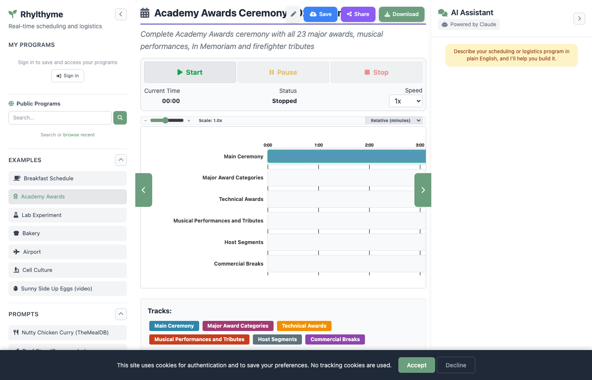

# Getting Started

This page covers the different ways to load a Rhylthyme program into the web app for visualization.

## Loading an Example

The left sidebar includes a set of built-in examples that span different environment types. Click any example to load it instantly.

| Example | Environment | Description |
|---------|-------------|-------------|
| Breakfast Schedule | Kitchen | Coordinating eggs, bacon, and toast |
| Academy Awards | Events | Multi-track ceremony production |
| Lab Experiment | Laboratory | Sequential lab protocol |
| Bakery | Bakery | Bread and pastry production |
| Airport | Airport | Runway, gate, and taxiway coordination |
| Cell Culture | Laboratory | Cell culture experimental protocol |
| Sunny Side Up Eggs | Kitchen | Step-by-step cooking with video |



!!! tip "Sunny Side Up Eggs includes video"
    The Sunny Side Up Eggs example includes embedded video tooltips for each step. Hover over a step node in the DAG view to see the associated video clip.

## Uploading a Program

You can upload your own program files directly from your computer.

### Drag and Drop

1. Scroll to the **Upload Program** section in the left sidebar.
2. Drag a `.json`, `.yaml`, or `.yml` file onto the drop zone.
3. The program will be validated and visualized automatically.

### File Browser

1. Click the drop zone area labeled "Drop file here or click to browse."
2. Select a file from your file system.
3. The program loads into the main visualization area.

!!! note "File Size Limit"
    Uploaded files are limited to 16 MB.

## Loading from URL

If your program JSON is hosted online (for example, in a GitHub repository), you can load it directly by URL.

1. Scroll to the **Load from URL** section in the left sidebar.
2. Paste the URL into the text field. For GitHub files, use the raw URL (e.g., `https://raw.githubusercontent.com/rhylthyme/rhylthyme-examples/main/programs/breakfast_schedule.json`).
3. Click the download button to fetch and visualize the program.

!!! tip "GitHub Raw URLs"
    For files on GitHub, click the "Raw" button on the file page to get the direct URL, or construct it manually by replacing `github.com` with `raw.githubusercontent.com` and removing `/blob/`.

## Using Prompts (AI Import)

The **Prompts** section in the sidebar provides pre-built queries that use the AI chat assistant to import and generate programs from external sources.

| Prompt | Source | What It Does |
|--------|--------|--------------|
| Nutty Chicken Curry | TheMealDB | Imports a chicken curry recipe and creates a cooking schedule |
| Beef Stew | Spoonacular | Searches Spoonacular for a beef stew recipe and creates a cooking schedule |
| RNA Extraction with Trizol | protocols.io | Imports a lab protocol and creates a laboratory schedule |

Clicking a prompt automatically sends it to the AI chat panel. The assistant will call the appropriate importer, convert the external data into a Rhylthyme program, and visualize it.

!!! note "Chat Required"
    Prompts use the AI chat feature, which requires the Anthropic API to be available. On the hosted version at www.rhylthyme.com, this works out of the box.

## Browsing Public Programs

The **Public Programs** section in the sidebar lets you search for and load programs shared by other users.

1. Type a search term into the search field (e.g., "breakfast" or "lab").
2. Click the search icon or press Enter.
3. Click on a result to load and visualize it.

Alternatively, click "browse recent" to see the most recently shared programs.

## Loading a Shared Program

When someone shares a program, they get a URL with a `?share=` parameter. Opening that URL in your browser will automatically load and visualize the shared program.

```
https://www.rhylthyme.com?share=abc123
```

## What Happens After Loading

Once a program is loaded (by any method), the web app:

1. Validates the program against the Rhylthyme schema.
2. Generates the visualization HTML with all five views.
3. Displays the program in the main content area with:
    - A **program info bar** showing total time, schema version, environment type, and resource constraints.
    - **Execution controls** for running the program in real time.
    - A **view toggle bar** at the bottom for switching between DAG, Timeline, Resources, Itinerary, and Editor.
4. Shows **Save**, **Share**, and **Download** buttons in the top-right corner of the main area.

The program is now stored in memory (as `currentProgram`) and remains available for download, saving to your account, or sharing until you load a different program.

## Enriching an Import

Importers read a source document's *structure*, not its meaning. A recipe or a protocols.io protocol comes back as **one track**: every step chained one after another, in the order the document listed them. That is a faithful transcription, but it is rarely how the work is actually carried out — while the blot blocks, you prepare the antibody; while the turkey roasts, you make the gravy.

The **Enrich** option on an import asks a language model to do the part the importer cannot: work out which steps belong on parallel tracks, and what each one actually waits for.

### What it does

| Kept exactly as imported | Inferred by enrichment |
|---|---|
| Every step, with its name, task and duration | Which track each step belongs to |
| The program's id, name and source URL | Every step's start trigger, including cross-track ones |
| The words each step came from (`metadata.sourceSpan`) | Steps the source never stated — a preheat, a warm-up, a cooling wait |

Anything the model *adds* is flagged `metadata.inferred` so you can tell it apart from what was read out of the source, and the program records `metadata.source.enriched` with the model that did it. The result is run through the same validator the Editor uses, with up to two automatic correction rounds.

### Cost and limits

Enrichment costs one model call (plus up to two correction calls), so:

- **Sign-in is required**, as it is for every import.
- **20 enrichments per day per account.** Over the cap, the import is refused with "Daily enrich limit reached"; the quota is separate from the ordinary import quota and resets on a rolling 24 hours.
- **A failed enrichment never loses your import.** If the model is unavailable, the server has no API key, or the enriched program will not validate after two correction rounds, you get the plain one-track import back with a note explaining why.

### Where to find it

- **API:** `POST /api/import` with `{"source": "protocolsio", "url": "…", "enrich": true}`. The response is `{program, enrichment}`, where `enrichment` is `{added, changed, iterations, tracks, model, tokens}` — or `{error}` when it did not run. `POST /api/url` accepts `enrich` too and visualizes the enriched program directly.
- **MCP:** `import_from_source` takes an `enrich` boolean alongside `action: "import"` — see [MCP Server](mcp.md).

Enrichment is a suggestion, not a verdict. Open the enriched program in the **Editor** view and check the triggers before you run it against a real clock.
