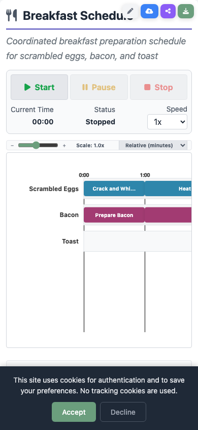

# Visualization

The web app provides five distinct views for understanding and interacting with a Rhylthyme program. Switch between them using the **view toggle bar** at the bottom of the main content area.

## Program Info Bar

At the top of the visualization, a compact info bar displays key program metadata:

- **Total Time** -- The calculated total duration of the program
- **Schema Version** -- The Rhylthyme schema version (e.g., `0.1.0`)
- **Environment Type** -- The environment the program is designed for (kitchen, laboratory, etc.), if specified
- **Resource Constraints** -- A summary of the resource limits defined in the program
- **Tracks** -- The number of parallel execution tracks

## Views

### DAG View

The DAG (Directed Acyclic Graph) view shows the dependency structure of the program as a node-link diagram. Each step is a node, and edges represent dependencies (start triggers).

Key features:

- **Color-coded by track** -- Each track has a distinct color so you can see which steps belong together.
- **Node details on hover** -- Hovering over a node reveals the step name, description, task assignment, and duration.
- **Video tooltips** -- For programs with embedded media (like the Sunny Side Up Eggs example), hovering over a step shows the associated video clip.
- **Program Start node** -- A virtual "Program Start" node at the top shows which steps begin at program start.
- **Buffer indicators** -- Pre-buffer and post-buffer times are displayed on edges where applicable.

### Timeline View

The Timeline view presents the program as a Gantt-style chart with tracks on the vertical axis and time on the horizontal axis.

Key features:

- **Tracks and steps** -- Each track is a horizontal lane containing colored bars for its steps.
- **Time axis** -- The horizontal axis shows elapsed time with configurable scale (seconds, minutes, hours).
- **Zoom and scale controls** -- Adjust the time scale and zoom level to see the full program or focus on a section.
- **Progress bar during execution** -- When a program is running, a vertical progress line moves across the chart and step bars fill to show completion.
- **Step labels** -- Each bar displays the step name and task type.

### Resources View

The Resources view shows how the program uses its declared resource constraints over time.

Key features:

- **Per-resource charts** -- Each resource constraint (e.g., "stove-burner", "prep-station") gets its own chart.
- **Peak usage indicator** -- Shows the maximum concurrent usage of each resource and whether it approaches or hits the limit.
- **Utilization percentage** -- Displays the overall utilization of each resource across the program duration.
- **Capacity line** -- A horizontal line marks the `maxConcurrent` limit for each resource.

### Itinerary View

The Itinerary view presents the program as a chronological, step-by-step list -- similar to a printed recipe or lab protocol.

Key features:

- **Chronological ordering** -- Steps are listed in the order they start, regardless of which track they belong to.
- **Step details** -- Each entry shows the step name, track, task, start time, duration, and description.
- **Elapsed and remaining time** -- During execution, each step shows how much time has elapsed and how much remains.
- **Status indicators** -- Steps are marked as upcoming, active, or complete during execution.

### Editor View

The Editor view provides a JSON editor for directly viewing and modifying the program source.

Key features:

- **Syntax-highlighted JSON** -- The full program JSON is displayed in an editable text area.
- **Format button** -- Automatically formats the JSON with consistent indentation.
- **Save & Regenerate** -- After making changes, click this button to re-validate and re-visualize the modified program. The updated program replaces the current visualization across all views.

!!! warning "Editor Changes Are Not Auto-Saved"
    Changes made in the Editor view only take effect when you click "Save & Regenerate." If you switch to another view or load a different program, your edits will be lost unless you save first.

## Program Execution

The execution panel sits between the program info bar and the visualization views. It provides controls for running the program in simulated real time.

### Controls

| Control | Description |
|---------|-------------|
| **Start** | Begin or resume program execution from the current position |
| **Pause** | Pause execution at the current time |
| **Stop** | Stop execution and reset to the beginning |
| **Current Time** | Displays the current elapsed time in the program |
| **Speed Selector** | Adjust execution speed (e.g., 1x, 2x, 5x, 10x, 50x, 100x) |
| **Settings** | Open the visualization settings modal |

### Execution Behavior

When you start execution:

1. The **Timeline view** shows a moving progress line and fills step bars as they complete.
2. The **Itinerary view** updates each step's elapsed/remaining time and marks steps as active or complete.
3. The **execution status** in the control panel updates to show "Running", "Paused", or "Stopped."
4. The **current time** display ticks forward according to the selected speed.

!!! tip "Speed Control"
    Use higher speed multipliers to preview long programs quickly. A 30-minute breakfast schedule at 100x speed completes in about 18 seconds.

### Settings

The Settings modal (accessible from the gear icon in the execution panel) allows you to customize:

- **Theme** -- Color scheme and visual preferences
- **Timeline display** -- Scale, zoom, and label options
- **Execution defaults** -- Default speed and auto-start behavior

Settings are persisted in browser cookies so they carry over between sessions.

## Actions Bar

When a program is loaded, three action buttons appear in the top-right corner of the main content area:

| Button | Action |
|--------|--------|
| **Save** | Save the program to your account (requires sign-in) |
| **Share** | Generate a share link and copy it to the clipboard (requires sign-in) |
| **Download** | Download the program as a `.json` file to your computer |

There is also a pencil icon to **edit the program title**, which sets the display name used when saving.

!!! note "Download Is Always Available"
    The Download button works without signing in. Save and Share require an account.
