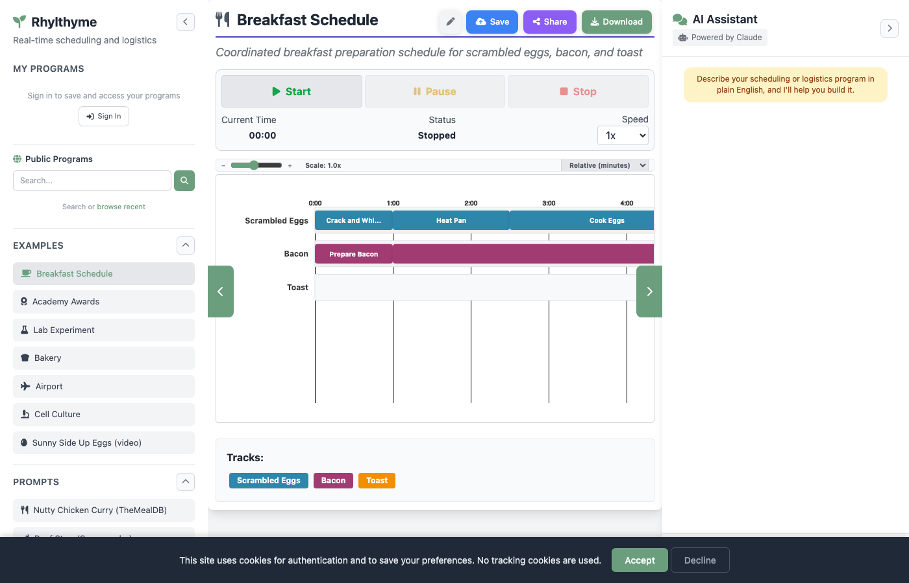
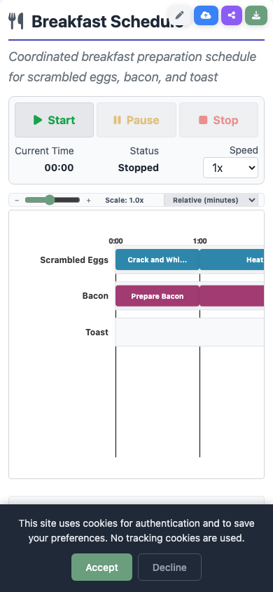

# Visualization

The web app provides five distinct views for understanding and interacting with a Rhylthyme program. Switch between them using the **view toggle bar** at the bottom of the main content area.

## Program Info Bar

At the top of the visualization, a compact info bar displays key program metadata:

- **Total Time** -- The calculated total duration of the program
- **Schema Version** -- The Rhylthyme schema version (e.g., `0.1.0`)
- **Environment Type** -- The environment the program is designed for (kitchen, laboratory, etc.), if specified
- **Resource Constraints** -- A summary of the resource limits defined in the program
- **Tracks** -- The number of parallel execution tracks

## Views

### DAG View

The DAG (Directed Acyclic Graph) view shows the dependency structure of the program as a node-link diagram. Each step is a node, and edges represent dependencies (start triggers).


Key features:

- **Color-coded by track** -- Each track has a distinct color so you can see which steps belong together.
- **Node details on hover** -- Hovering over a node reveals the step name, description, task assignment, and duration.
- **Video tooltips** -- For programs with embedded media (like the Sunny Side Up Eggs example), hovering over a step shows the associated video clip.
- **Program Start node** -- A virtual "Program Start" node at the top shows which steps begin at program start.
- **Buffer indicators** -- Pre-buffer and post-buffer times are displayed on edges where applicable.

### Timeline View

The Timeline view presents the program as a Gantt-style chart with tracks on the vertical axis and time on the horizontal axis.



Key features:

- **Tracks and steps** -- Each track is a horizontal lane containing colored bars for its steps.
- **Time axis** -- The horizontal axis shows elapsed time with configurable scale (seconds, minutes, hours).
- **Zoom and scale controls** -- Adjust the time scale and zoom level to see the full program or focus on a section.
- **Progress bar during execution** -- When a program is running, a vertical progress line moves across the chart and step bars fill to show completion.
- **Step labels** -- Each bar displays the step name and task type.



### Planned vs actual: a recorded run

Every execution leaves a **run record**: the timings the program planned,
frozen when the run started, beside the timings that actually happened
(see the [Runs Schema Reference](../development/runs-schema.md)). The same
Gantt renderer draws that comparison, from the CLI with
[`rhylthyme runs show RUN --svg out.svg`](../development/cli.md#drawing-a-run-svg)
and in the web app from a run in your library.

How to read it:

| What you see | What it means |
|---|---|
| **Solid bar** | when the step actually ran |
| **Thin ghost bar underneath** | where the plan said it would run. Its left edge is the planned start, its right edge the planned end |
| **Green outline** | the step finished on time — its end landed within the threshold (30 seconds by default) of the plan |
| **Blue outline** | the step finished *early* |
| **Red outline** | the step finished *late* |

The colour is the sign of the **end** deviation, not the start: a step that
starts late but catches up is still on time. The threshold exists so that a
few seconds of timer or tick lag does not read as a schedule slip; it is the
renderer's `deviationThreshold` option, and the legend always names the value
in force (`late (>30s)`).

Because the deviation is measured against the frozen plan, a slip propagates:
if an indefinite step (the roast that ends when the cook says so) runs 25
minutes past its `defaultSeconds`, it shows red and so does everything
triggered off it, with each ghost bar showing exactly how far behind its plan
the step ended up. That cascade is the point of the view — it separates *this
step took longer than I guessed* from *this step was late because something
upstream was*.

Steps whose bar is identical to its ghost ran exactly to plan. A step that
never started has no actual bar.

The same picture is available from an assistant: `preview_timeline` takes an
optional `run` alongside the program and returns the comparison as an image
(see [MCP tools](mcp.md#preview_timeline)).

### Calibrate from runs

Reading the comparison tells you a duration is wrong. **Calibrating** changes
it. On a program's player page, signed in and with at least one recorded run,
a **Calibrate from my runs** card appears under the Runs list.

Pressing the button asks the server for a *proposal* — nothing is changed yet
— and shows one row per step:

| Column | What it is |
|---|---|
| checkbox | ticked for every step that has a number to propose, and disabled for the rest so you cannot accept something that was not offered |
| **n** | how many of your runs measured this step |
| **Current** | what the program says now: one number for a fixed step, `min–default–max` for a range |
| **Proposed** | the median as the new default, the 10th/90th percentiles as the new range |
| **Median** | the observed median, so the proposal is checkable |
| **Delta** | how far the proposed default moves the current one |
| **Note** | the verdict (`predictable`, `executor-controlled`), or why the step was skipped |

Under the table, one line says what accepting the ticked steps would do to
the total time and whether the critical path moves.

Three rules are worth knowing before you accept anything:

- **A proposed range is never narrower than yours.** The percentiles are
  widened until they contain whatever you wrote, plus the new default. History
  can tell you your range was too tight; it is not allowed to tell you it was
  too loose.
- **An indefinite step gets a default and no range.** Its end is your
  decision, not a bound the plan should pretend to know.
- **A fixed step never gets a number.** Its observed length only confirms its
  timer. What history *can* say is how late its planned end really was, so a
  fixed step that consistently overruns comes back with a "consider variable"
  note and its measured lag — a suggestion to change the step's *kind*, which
  only you can make.

A step you have run fewer than five times is skipped with its statistics
shown anyway, so you can see how close it is to having enough evidence.

**Apply** asks for confirmation inline (no pop-up dialog), then writes the
ticked durations and saves the program to your library. Each written duration
carries its provenance in the JSON:

```json
"duration": {
  "type": "indefinite",
  "defaultSeconds": 1179,
  "calibratedFrom": { "runs": 20, "asOf": "2026-09-14T00:00:00Z",
                      "programVersion": "sha256:935c4ca9…" }
}
```

Steps carrying that stamp get a green badge in the Runs card, so a calibrated
duration is never mistaken for an authored one. `programVersion` is the plan
the *measurements* came from, which is not necessarily the plan they were
written into — an edited program's history is about the version that ran.

The same proposal is available to an assistant as the `calibrate_program`
tool ([MCP tools](mcp.md#calibrate_program)) and in the terminal as
[`rhylthyme calibrate`](../development/cli.md).

### Resources View

The Resources view shows how the program uses its declared resource constraints over time.


Key features:

- **Per-resource charts** -- Each resource constraint (e.g., "stove-burner", "prep-station") gets its own chart.
- **Peak usage indicator** -- Shows the maximum concurrent usage of each resource and whether it approaches or hits the limit.
- **Utilization percentage** -- Displays the overall utilization of each resource across the program duration.
- **Capacity line** -- A horizontal line marks the `maxConcurrent` limit for each resource.

### Itinerary View

The Itinerary view presents the program as a chronological, step-by-step list -- similar to a printed recipe or lab protocol.


Key features:

- **Chronological ordering** -- Steps are listed in the order they start, regardless of which track they belong to.
- **Step details** -- Each entry shows the step name, track, task, start time, duration, and description.
- **Elapsed and remaining time** -- During execution, each step shows how much time has elapsed and how much remains.
- **Status indicators** -- Steps are marked as upcoming, active, or complete during execution.

### Editor View

The Editor view provides a JSON editor for directly viewing and modifying the program source.


Key features:

- **Syntax-highlighted JSON** -- The full program JSON is displayed in an editable text area.
- **Format button** -- Automatically formats the JSON with consistent indentation.
- **Save & Regenerate** -- After making changes, click this button to re-validate and re-visualize the modified program. The updated program replaces the current visualization across all views.

!!! warning "Editor Changes Are Not Auto-Saved"
    Changes made in the Editor view only take effect when you click "Save & Regenerate." If you switch to another view or load a different program, your edits will be lost unless you save first.

## Auto-Plan

In edit mode the toolbar offers four planning strategies. Each one recomputes
every step's start time from the program's dependencies and writes the result
back into all views; **Reset** restores the schedule you started from.

| Strategy | What it does |
|----------|--------------|
| **Event Cover** | Schedules steps one after another, alternating tracks for variety |
| **Sync Finish** | Delays shorter tracks so every track finishes at the same time |
| **Min Length** | Packs every step as early as its dependencies allow (the default) |
| **Fit to Time** | Compresses variable-duration steps, then drops or flags low-priority work to hit the target duration |

### Both limits are respected

Two different limits can bind a schedule, and the planners respect both:

- **`resourceConstraints.maxConcurrent`** caps how many steps may use one task
  at the same instant -- one oven, two rack slots, six thermocycler blocks.
- **`replicates.maxInFlight`** caps how many *instances* of a replicated step
  may be between that step and its barrier at once -- three trays baked into a
  rack that holds two. Expansion turns this into a gate on the later
  instances, so Min Length and Sync Finish hold instance *i + k* until
  instance *i* has cleared the last step of its per-instance chain, rather
  than packing it early and stranding it.

On the three-trays example (`cookies_three_trays`), Min Length therefore
returns a 74-minute schedule in which the third bake waits for the first tray
to leave the rack. Planning it without the in-flight gate would return 71
minutes and a hot tray with nowhere to go.

### Fit to Time and replicated steps

When Fit to Time cannot reach the target by compressing variable durations, it
drops whole **instance chains**, trailing instance first: dropping `bake-r3`
also drops the `instances: "each"` steps paired with it (`cool-r3`), never one
without the other. The `instances: "all"` barrier downstream is then re-derived
over the instances that remain, so `box` waits for two trays instead of three.
Dropped steps are reported as *omitted* in the toast and greyed in the views;
steps that keep their full duration but push past the target are flagged *in
jeopardy* instead.

### Conflicts after planning

After the conflict resolver has moved steps around, the page re-checks the
schedule and logs what is still broken. Every item it reports carries a `kind`:

| `kind` | Meaning |
|--------|---------|
| `maxConcurrent` | A task is over its instantaneous cap; the item names the task, the time, and the steps competing for it |
| `inFlight` | More instances of a replicated step are between it and its barrier than `maxInFlight` allows; the item names the replicated step, the window, the instances involved, and a fix hint |

Only `maxConcurrent` conflicts can be repaired by moving a step to another
slot. An `inFlight` conflict is fixed by holding the upstream instance back or
by raising `maxInFlight`, so it is reported rather than shuffled.

## Program Execution

The execution panel sits between the program info bar and the visualization views. It provides controls for running the program in simulated real time.

### Controls

| Control | Description |
|---------|-------------|
| **Start** | Begin or resume program execution from the current position |
| **Pause** | Pause execution at the current time |
| **Stop** | Stop execution and reset to the beginning |
| **Current Time** | Displays the current elapsed time in the program |
| **Speed Selector** | Adjust execution speed (e.g., 1x, 2x, 5x, 10x, 50x, 100x) |
| **Settings** | Open the visualization settings modal |

### Execution Behavior

When you start execution:

1. The **Timeline view** shows a moving progress line and fills step bars as they complete.
2. The **Itinerary view** updates each step's elapsed/remaining time and marks steps as active or complete.
3. The **execution status** in the control panel updates to show "Running", "Paused", or "Stopped."
4. The **current time** display ticks forward according to the selected speed.

!!! tip "Speed Control"
    Use higher speed multipliers to preview long programs quickly. A 30-minute breakfast schedule at 100x speed completes in about 18 seconds.

### Settings

The Settings modal (accessible from the gear icon in the execution panel) allows you to customize:

- **Theme** -- Color scheme and visual preferences
- **Timeline display** -- Scale, zoom, and label options
- **Execution defaults** -- Default speed and auto-start behavior

Settings are persisted in browser cookies so they carry over between sessions.

## Actions Bar

When a program is loaded, three action buttons appear in the top-right corner of the main content area:

| Button | Action |
|--------|--------|
| **Save** | Save the program to your account (requires sign-in) |
| **Share** | Generate a share link and copy it to the clipboard (requires sign-in) |
| **Download** | Download the program as a `.json` file to your computer |

There is also a pencil icon to **edit the program title**, which sets the display name used when saving.

!!! note "Download Is Always Available"
    The Download button works without signing in. Save and Share require an account.
